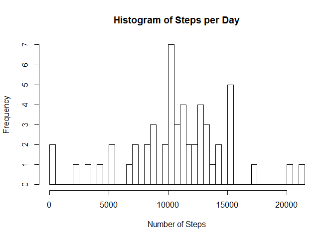
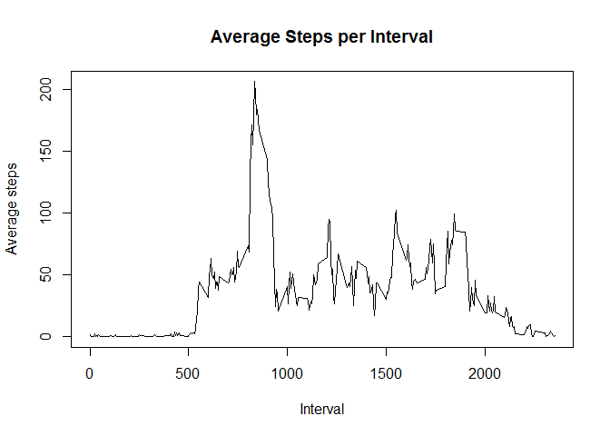
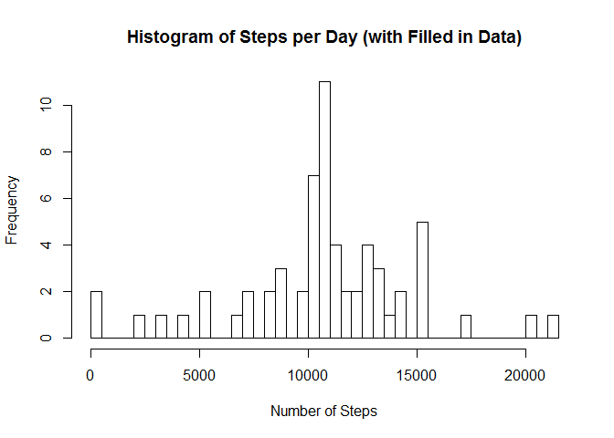
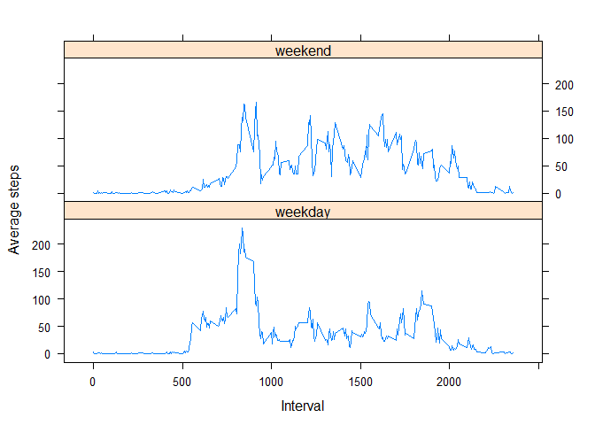

# Reproducible Research: Peer Assessment 1
Lenny Fenster  
Saturday, October 18, 2014  


## Assignment
  
It is now possible to collect a large amount of data about personal movement using activity monitoring devices such as a Fitbit, Nike Fuelband, or Jawbone Up. These type of devices are part of the "quantified self" movement -- a group of enthusiasts who take measurements about themselves regularly to improve their health, to find patterns in their behavior, or because they are tech geeks. But these data remain under-utilized both because the raw data are hard to obtain and there is a lack of statistical methods and software for processing and interpreting the data.

This assignment makes use of data from a personal activity monitoring device. This device collects data at 5 minute intervals through out the day. The data consists of two months of data from an anonymous individual collected during the months of October and November, 2012 and include the number of steps taken in 5 minute intervals each day.


## Loading and preprocessing the data
First the data must be loaded and tranformed for analysis.  It can be assumed that the zip file is already in the directory.  If the CSV file is not yet, extracted, we extract it and then read it into the *activities* dataset


```r
    ##check for csv file
    if(!file.exists("activity.csv"))
    {
        ##extract file from zip.  suppress warnings for files we dont need to overwrite
        suppressWarnings(unzip("activity.zip", overwrite = FALSE))
    }

    activities<-read.csv("activity.csv")
```

The date field is formatted as a true Date data type.

```r
    ##tranform date field into date data type
    activities$date <- as.Date(activities$date, format="%Y-%m-%d")
```


## What is mean total number of steps taken per day?
For this part of the assignment, missing values in the dataset can be ignored.  Therefore, we omit all NA values


```r
omittedData<-na.omit(activities)
```

The number of steps per day is calculated and displayed as a histogram 

```r
stepsPerDay<-aggregate(omittedData$steps, list(Date=omittedData$date), sum)
hist(stepsPerDay$x, xlab="Number of Steps", main="Histogram of Steps per Day", breaks=length(stepsPerDay$Date))
```

 

The mean and median are calculated using the mean and median functions for this dataset's calculated value

```r
options(scipen = 10)
meanStepsPerDay<-mean(stepsPerDay$x)
medianStepsPerDay<-median(stepsPerDay$x)
```

The average number of steps per day is 10766.19 and the median is 10765.

## What is the average daily activity pattern?
We want to see a time series plot of the 5-minute interval (x-axis) and the average number of steps taken, averaged across all days (y-axis).  


```r
avgStepsPerInterval<-tapply(activities$steps, activities$interval, mean, na.rm=TRUE)
plot(x=dimnames(avgStepsPerInterval)[[1]], avgStepsPerInterval, type="l", xlab="Interval", ylab="Average steps", main="Average Steps per Interval")
```

 

To determine which 5-minute interval, on average across all the days in the dataset, contains the maximum number of steps, we use the max function to find the index for interval and then use that index to ascertain the value. 

```r
maxAvgIndex<-which.max(avgStepsPerInterval)
maxAvgValue<-avgStepsPerInterval[maxAvgIndex]
```

The maximum number of average steps is 206.1698 and is at interval 835.


## Imputing missing values
There are a number of days/intervals where there are missing values (coded as  NA). The presence of missing days may introduce bias into some calculations or summaries of the data.  We want to understand if this bias exists.

First we calculate and report the total number of missing values in the dataset (i.e. the total number of rows with  NA s)

```r
sum(is.na(activities$steps))
```

```
## [1] 2304
```

The number of missing values is 2304.

Then we devise a strategy for filling in all of the missing values in the dataset. The strategy chosen here is to impute all the missing values with the mean value for the interval.  In this way, we should not be impacting the overall average number of steps per interval. We store this new dataset as *imputedSteps*.


```r
meanForInterval<-function(interval) {
    return (avgStepsPerInterval[interval][[1]])
}

imputedSteps<-activities
for (i in 1:nrow(imputedSteps)) {
    if (is.na(imputedSteps$steps[i])) {
        imputedSteps$steps[i] <- meanForInterval(as.character(imputedSteps$interval[i]))
    }
}
```

Then we make a histogram similar to the first histogram created and which includes the total number of steps taken each day.  

```r
nonOmittedStepsPerDay<-aggregate(imputedSteps$steps, list(Date=imputedSteps$date), sum)
hist(nonOmittedStepsPerDay$x, xlab="Number of Steps", main="Histogram of Steps per Day (with Filled in Data)", breaks=length(nonOmittedStepsPerDay$Date))
```

 

The mean and median total number of steps taken per day is calculated for this new dataset with imputed data.

```r
nonOmittedMeanStepsPerDay<-mean(nonOmittedStepsPerDay$x)
nonOmittedMedianStepsPerDay<-median(nonOmittedStepsPerDay$x)
```

The average number of steps per day for the imputed dataset us  10766.19 and the median is 10766.19.  Although the median is slightly higher, there is not a significant change for either mean or median. It is noteworthy that the mean and median are now equal.

## Are there differences in activity patterns between weekdays and weekends?

To determine whether there are differences between weekdays and weekend days, we made a panel plot containing a time series plot of the 5-minute interval (x-axis) and the average number of steps taken, averaged across all weekday days or weekend days (y-axis). 

```r
imputedSteps$weekdays<-factor(weekdays(imputedSteps$date))
levels(imputedSteps$weekdays)<-list(weekday=c("Monday", "Tuesday","Wednesday","Thursday", "Friday"), weekend=c("Saturday", "Sunday"))
weekdayAvgSteps<-aggregate(imputedSteps$steps, list(Interval=imputedSteps$interval, WeekDay=imputedSteps$weekdays), mean)
library(lattice)
weekdayPlot<-xyplot(weekdayAvgSteps$x~weekdayAvgSteps$Interval|weekdayAvgSteps$WeekDay, type="l", xlab="Interval", ylab="Average steps", layout=c(1,2))
print(weekdayPlot)
```

 


